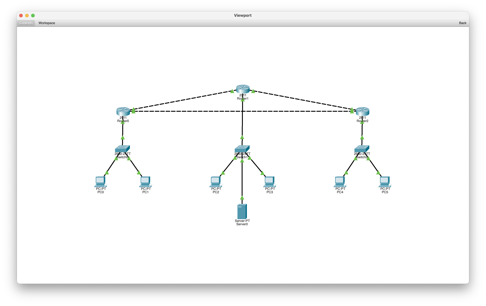

# Cisco Static Routing, DHCP and DNS Lab

[](https://www.netacad.com/cisco-packet-tracer)
[](#routing-design)
[](#services)

Three-site Cisco Packet Tracer lab demonstrating IPv4 subnetting, router-based DHCP, centralized DNS, primary static routes, and floating static routes for WAN path resilience.



## Project overview

The lab models three small office sites connected by a triangle of Cisco 2911 routers. Each site has a local `/24` LAN, a Cisco 2960 access switch, and two DHCP clients. Site 2 hosts a DNS server used by clients at all three locations.

Each router owns its local DHCP scope and has a direct primary route to the other two LANs. Floating static routes use administrative distance `10` to provide an alternate path after a direct WAN link is shut down.

## What this project demonstrates

- IPv4 addressing with `/24` LANs and efficient `/30` point-to-point links
- Cisco IOS interface, switch management, and access-port configuration
- Router-based DHCP with excluded infrastructure addresses
- Centralized DNS records for routers, switches, and the DNS server
- Primary and floating static routes across redundant WAN paths
- Structured connectivity, name-resolution, and failover validation
- Practical troubleshooting with IOS and Packet Tracer commands

## Topology

| Site | LAN | Gateway | Switch management | Endpoints |
|---|---|---|---|---|
| Site 1 | `192.168.10.0/24` | `192.168.10.1` | `192.168.10.2` | PC1 and PC2 |
| Site 2 | `192.168.20.0/24` | `192.168.20.1` | `192.168.20.2` | PC3, PC4, and DNS server |
| Site 3 | `192.168.30.0/24` | `192.168.30.1` | `192.168.30.2` | PC5 and PC6 |

The routed triangle uses these point-to-point networks:

- R1–R2: `10.0.12.0/30`
- R1–R3: `10.0.13.0/30`
- R2–R3: `10.0.23.0/30`

See [the complete addressing plan](docs/addressing-plan.md) for interface-level details.

## Routing design

Each router knows its connected networks and carries static routes for the two remote LANs. The direct neighbor is the preferred next hop. A second route with administrative distance `10` points through the remaining router.

For example, R1 normally reaches Site 2 through `10.0.12.2`. If the R1–R2 interface is shut down, the floating route through R3 at `10.0.13.2` becomes eligible and R3 forwards the traffic to R2.

> This lab demonstrates interface-failure recovery. In production, static routes alone may not detect every upstream failure while a local Ethernet interface remains up; IP SLA tracking or a dynamic routing protocol would provide stronger failure detection.

## Services

### DHCP

Each router supplies addresses to its local LAN. Addresses `.1` through `.20` are excluded for gateways, switch management, servers, and future infrastructure. Clients receive:

- An address from the local site range
- The local router as their default gateway
- `192.168.20.10` as their DNS server
- `practice.lab` as their domain name

### DNS

The server at `192.168.20.10` hosts A records for `dns.practice.lab`, the three routers, and the three switches. Client hostnames are not stored because their DHCP leases can change.

## Repository structure

```text
.
├── assets/
│   └── topology.png
├── configs/
│   ├── routers/
│   │   ├── R1.cfg
│   │   ├── R2.cfg
│   │   └── R3.cfg
│   └── switches/
│       ├── SW1.cfg
│       ├── SW2.cfg
│       └── SW3.cfg
├── docs/
│   ├── addressing-plan.md
│   ├── project-guide.docx
│   └── verification.md
├── packet-tracer/
│   └── static-routing-dhcp-dns-project.pkt
└── README.md
```

## Run the lab

1. Install Cisco Packet Tracer.
2. Download or clone this repository.
3. Open [`packet-tracer/static-routing-dhcp-dns-project.pkt`](packet-tracer/static-routing-dhcp-dns-project.pkt).
4. Allow the links to converge until their indicators are green.
5. Confirm each PC is set to DHCP under **Desktop → IP Configuration**.
6. Follow the [verification runbook](docs/verification.md).

## Validation scenarios

The lab is designed to prove three outcomes:

1. **Address assignment:** every client receives the correct local network, gateway, and DNS settings.
2. **End-to-end services:** clients reach remote LANs and resolve `practice.lab` names.
3. **WAN resilience:** traffic takes the alternate path after a direct inter-router link is disabled and returns to the preferred path when the link is restored.

Representative commands:

```text
show ip interface brief
show ip route static
show ip dhcp binding
ping 192.168.20.10
ping dns.practice.lab
tracert 192.168.30.21
```

## Skills demonstrated

`Cisco IOS` · `Packet Tracer` · `IPv4 subnetting` · `Static routing` · `Floating static routes` · `DHCP` · `DNS` · `Layer 2 switching` · `Network troubleshooting`

## Documentation

The [project guide](docs/project-guide.docx) contains the full protocol reference, cabling plan, configurations, verification commands, and troubleshooting notes. Plain-text configurations are provided separately for quick review and reuse.

## Author

**Mostafa GUELLIL**

- [GitHub](https://github.com/mostafaguellil)
- [Portfolio](https://portfolio.n2sid-solutions.com/)
